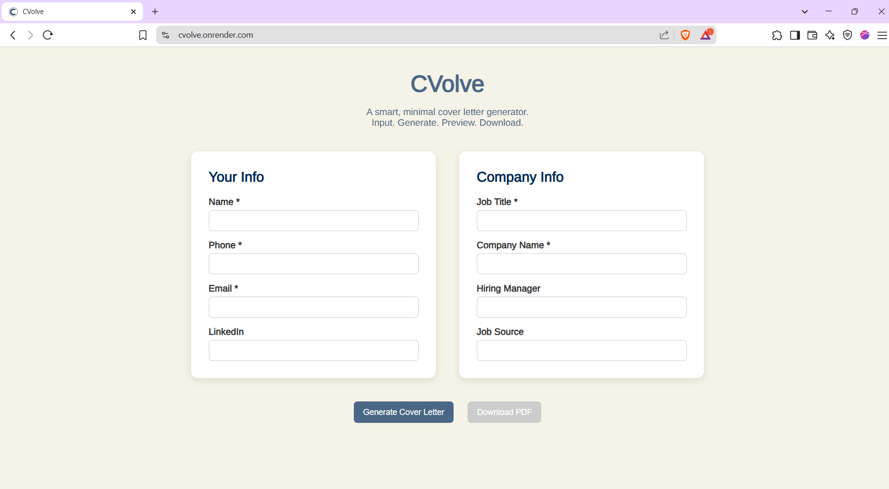

# ✨ CVolve - Smart Cover Letter Generator

> **Transform your job applications with AI-powered, personalized cover letters in seconds.**

CVolve is an elegant, minimalist web application that leverages Google's Gemini AI to generate professional, tailored cover letters. With its intuitive interface and instant PDF export, CVolve streamlines the job application process for modern professionals.

[](https://cvolve.onrender.com/)
[](LICENSE)
[](https://nodejs.org/)



---

## 🌟 Why CVolve?

- **⚡ Lightning Fast**: Generate professional cover letters in under 30 seconds
- **🎯 Tailored Content**: AI analyzes job requirements to create personalized letters
- **📱 Responsive Design**: Works seamlessly across desktop, tablet, and mobile
- **🔒 Privacy First**: Your data stays secure - no storage, no tracking
- **💰 Cost Effective**: Uses free Gemini API with generous rate limits

---

## 🔥 Key Features

### 📝 **Smart Input System**
- **Dual-card layout** for organized data entry
- **Auto-save** functionality to prevent data loss
- **Field validation** ensures complete information

### 🤖 **AI-Powered Generation**
- **Google Gemini Flash** model for high-quality output
- **Context-aware** letter generation
- **Professional tone** optimization
- **Industry-specific** customization

### 👀 **Live Preview**
- **Real-time** cover letter preview
- **Formatted display** with proper styling
- **Edit and regenerate** options

### 📄 **PDF Export**
- **One-click download** as print-ready PDF
- **Professional formatting** with clean typography
- **ATS-friendly** layout for applicant tracking systems

### 🎨 **Modern UI/UX**
- **Arimo font** for professional readability
- **Soft beige background** (#f5f2e7) with **dusky blue accents** (#4a6785)
- **Smooth animations** and micro-interactions
- **Accessible design** following WCAG guidelines

---

## 🛠️ Tech Stack

| Category | Technology |
|----------|------------|
| **Frontend** | HTML5, CSS3, Vanilla JavaScript |
| **Backend** | Node.js, Express.js |
| **AI Engine** | Google Gemini Flash API |
| **PDF Generation** | PDFKit |
| **Deployment** | Render (Backend), Static Hosting (Frontend) |

---

## 🚀 Quick Start

### Prerequisites
- Node.js 18+ and npm
- Google AI Studio account for Gemini API key

### Installation

```bash
# Clone the repository
git clone https://github.com/yourusername/cvolve.git
cd cvolve

# Install dependencies
npm install

# Set up environment variables
cp .env.example .env
# Edit .env and add your Gemini API key
echo "GEMINI_API_KEY=your_actual_api_key_here" > .env

# Start the development server
npm start
# or
node server.js
```

🌐 **Access the app**: http://localhost:3000

### Getting Your Gemini API Key

1. Visit [Google AI Studio](https://makersuite.google.com/app/apikey)
2. Sign in with your Google account
3. Create a new API key
4. Copy the key to your `.env` file

---

## 📁 Project Structure

```
CVolve/
├── 📁 public/                 # Frontend assets
│   ├── 📄 index.html         # Main HTML file
│   ├── 🎨 styles.css         # CSS styles
│   ├── ⚡ script.js          # Client-side JavaScript
│   └── 🖼️ preview.png       # UI preview image
├── 🗂️ server.js             # Express server
├── 🔐 .env                   # Environment variables (create this)
├── 📋 .env.example           # Environment template
├── 📦 package.json           # Dependencies
├── 🔒 .gitignore            # Git ignore rules
└── 📖 README.md             # Documentation
```

---

## 🎨 Design System

### Typography
- **Primary Font**: Arimo (Google Fonts)
- **Fallback**: Arial, sans-serif

### Color Palette
```css
/* Primary Colors */
--bg-primary: #f5f2e7;      /* Warm Beige */
--accent-primary: #4a6785;   /* Dusky Blue */
--text-primary: #002855;     /* Navy Blue */

/* Secondary Colors */
--text-secondary: #666;      /* Medium Gray */
--border: #ddd;              /* Light Gray */
--success: #28a745;          /* Success Green */
--error: #dc3545;            /* Error Red */
```

### Layout Principles
- **Mobile-first** responsive design
- **Card-based** interface for clear content separation
- **Generous whitespace** for improved readability
- **Consistent spacing** using 8px grid system

---

## 💡 How It Works

1. **📝 Input Phase**
   - Fill in personal details (name, contact, experience)
   - Enter job information (company, position, requirements)

2. **🤖 AI Processing**
   - Gemini AI analyzes your profile and job details
   - Generates contextually relevant content
   - Applies professional writing standards

3. **👁️ Preview & Edit**
   - Review the generated cover letter
   - Make adjustments if needed
   - Regenerate with modified inputs

4. **📄 Export**
   - Download as professionally formatted PDF
   - Ready for email or print submission

---

## 🔒 Security & Privacy

- **🔐 API Key Protection**: Environment variables keep sensitive data secure
- **🚫 No Data Storage**: User information is never saved or logged
- **🛡️ Input Sanitization**: All user inputs are validated and sanitized
- **🔒 HTTPS**: All communications encrypted in production

### Security Best Practices
```bash
# Ensure .env is in .gitignore
echo ".env" >> .gitignore

# Use strong API key rotation
# Monitor API usage in Google AI Studio
```

---

## 📊 Performance

- **⚡ Fast Load**: < 2s initial load time
- **🚀 Quick Generation**: Cover letters generated in < 30s
- **📱 Mobile Optimized**: Works on all device sizes
- **♿ Accessible**: WCAG 2.1 AA compliant

---

## 🚀 Deployment

### Deploy to Render (Recommended)

1. Fork this repository
2. Connect your GitHub to Render
3. Create a new Web Service
4. Add environment variable: `GEMINI_API_KEY`
5. Deploy!

### Deploy to Other Platforms

- **Vercel**: Perfect for serverless deployment
- **Netlify**: Great for static hosting with serverless functions
- **Railway**: Simple and developer-friendly
- **Heroku**: Classic PaaS solution

---

## 🛣️ Roadmap

### Phase 1 (Current)
- [x] Core cover letter generation
- [x] PDF export functionality
- [x] Responsive design
- [x] Basic error handling

### Phase 2 (Coming Soon)
- [ ] **Resume Upload & Analysis**: Auto-extract experience and skills
- [ ] **Multiple Tone Presets**: Formal, Friendly, Creative, Technical
- [ ] **Template Variants**: Different layouts and styles
- [ ] **Save & Manage**: User accounts for saving drafts

### Phase 3 (Future)
- [ ] **Chrome Extension**: Generate letters directly from job postings
- [ ] **LinkedIn Integration**: Import profile data automatically
- [ ] **Analytics Dashboard**: Track application success rates
- [ ] **Team Collaboration**: Share and review letters with mentors

---

## 🤝 Contributing

We welcome contributions! Here's how you can help:

1. **🍴 Fork** the repository
2. **🌿 Create** a feature branch (`git checkout -b feature/amazing-feature`)
3. **📝 Commit** your changes (`git commit -m 'Add amazing feature'`)
4. **🚀 Push** to the branch (`git push origin feature/amazing-feature`)
5. **🔀 Open** a Pull Request

### Development Guidelines
- Follow existing code style
- Add comments for complex logic
- Test on multiple devices
- Update documentation as needed

---

## 📝 License

This project is licensed under the MIT License - see the [LICENSE](LICENSE) file for details.

---

## 💬 Support & Feedback

- **🐛 Bug Reports**: [GitHub Issues](https://github.com/yourusername/cvolve/issues)
- **💡 Feature Requests**: [GitHub Discussions](https://github.com/yourusername/cvolve/discussions)
- **📧 Direct Contact**: [your.email@example.com](mailto:your.email@example.com)

---

## 🙏 Acknowledgments

- **Google AI Team** for the powerful Gemini API
- **Open Source Community** for inspiration and tools
- **Beta Testers** who provided valuable feedback

---

## 👩‍💻 About the Creator

**Aditi Sharma**  
🎓 *Computer Science Undergraduate | Full-Stack Developer | AI Enthusiast*

> *"Empowering job seekers with AI-driven tools to land their dream careers."*

[](https://linkedin.com/in/yourprofile)
[](https://github.com/yourusername)
[](https://yourportfolio.com)

---

<div align="center">

**Built with ❤️ using Google Gemini AI and modern web technologies**

*Star ⭐ this repo if CVolve helped you land your dream job!*

[](https://github.com/yourusername/cvolve)

</div>
